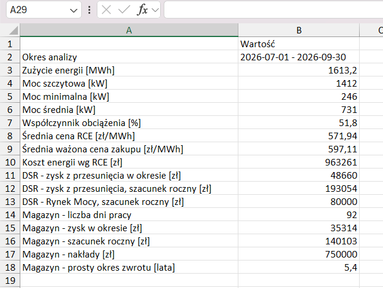
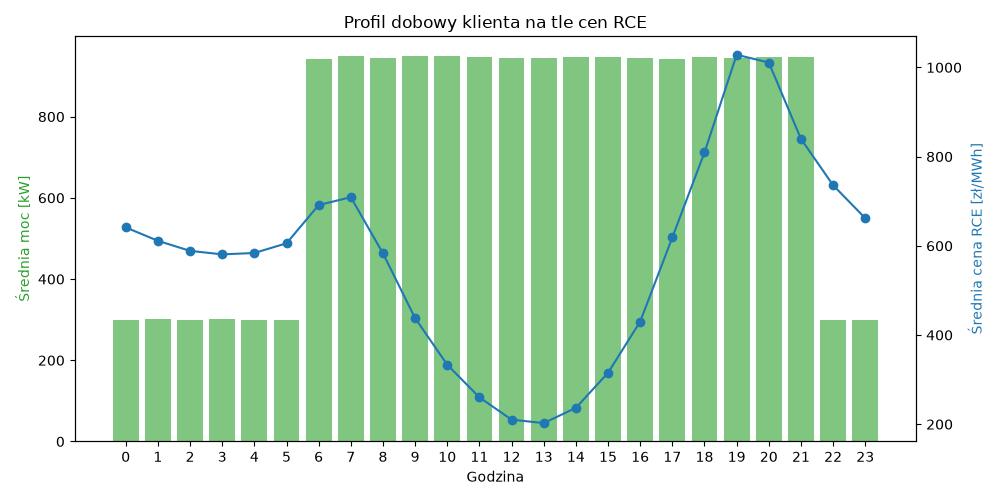
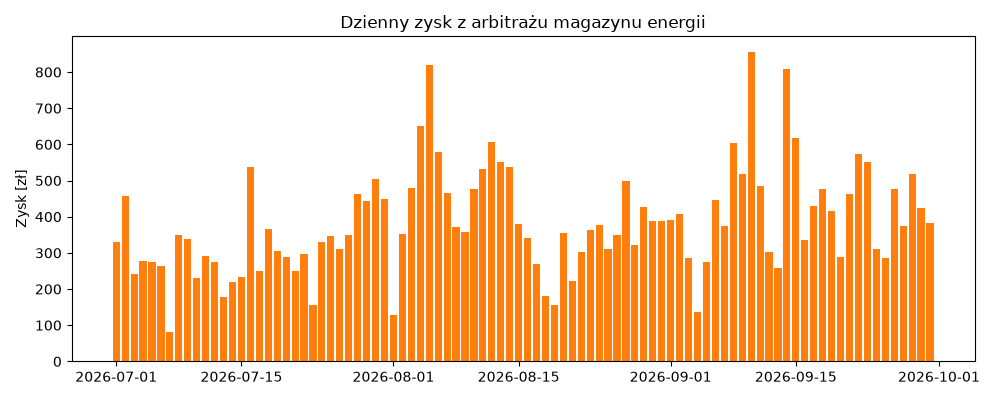
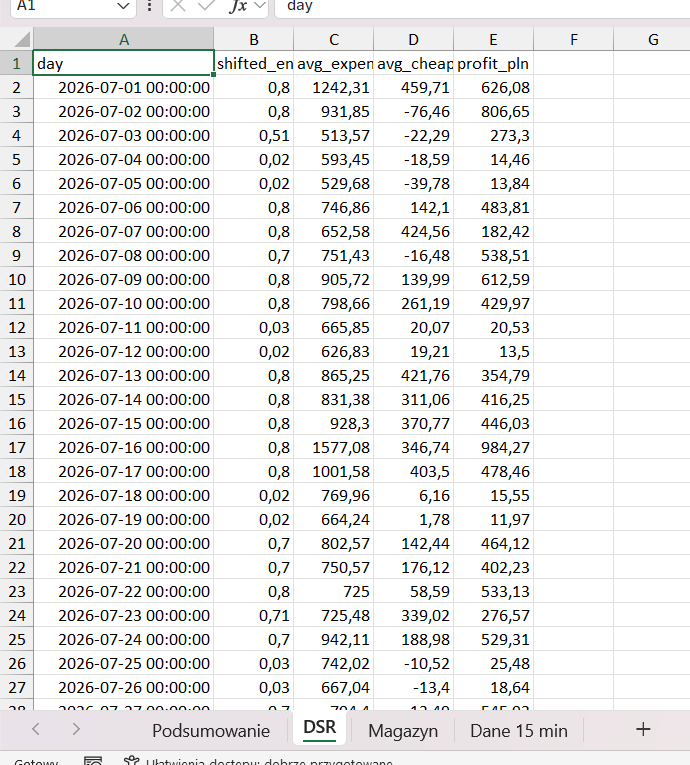
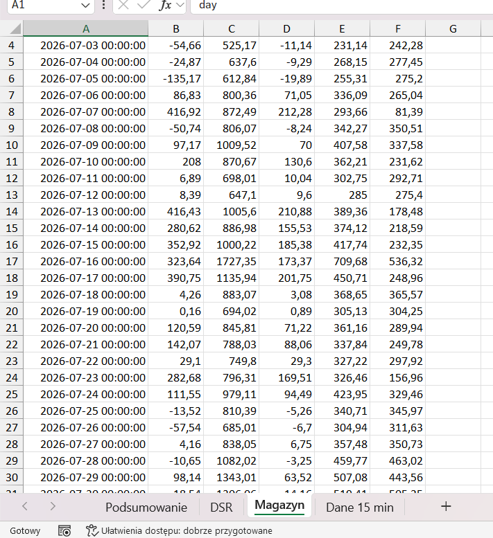
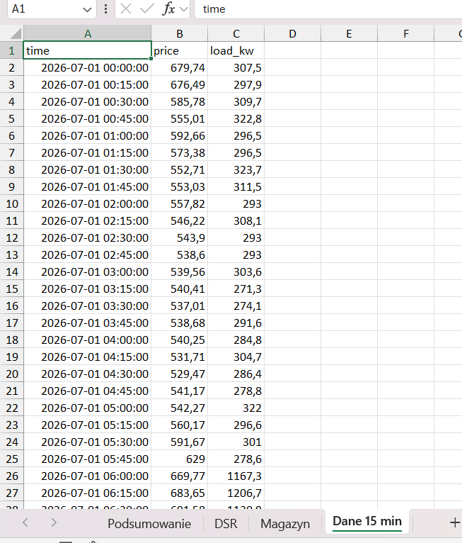

*English version below.*

# Analiza elastyczności odbiorcy przemysłowego

Prosty skrypt, który dla profilu zużycia energii firmy sprawdza, ile mogłaby ona zyskać na:

- **DSR** – przesunięciu części produkcji z najdroższych godzin doby na najtańsze (+ orientacyjny przychód z Rynku Mocy),
- **magazynie energii** – arbitrażu cenowym (ładowanie w najtańszych kwadransach, rozładowanie w najdroższych).

Ceny pobierane są z publicznego API PSE – **RCE (Rynkowa Cena Energii)**, z częstotliwością co 15 min.

### Uruchomienie

```
python -m venv .venv
.venv\Scripts\activate
pip install -r requirements.txt
python main.py
```

Parametry (okres, moc redukcji, wielkość magazynu, koszty) ustawia się na górze `main.py`.
Bez własnych danych skrypt generuje przykładowy profil zakładu pracującego na 2 zmiany.
Własny profil: plik csv `time;load_kw` z danymi 15-minutowymi, ścieżka w `PROFILE_FILE`.

### Wyniki

- `results/report.xlsx` – podsumowanie, wyniki dzienne DSR i magazynu, dane 15-min
- `results/daily_profile.png` – średni profil dobowy na tle cen RCE
- `results/battery.png` – dzienny zysk z magazynu

Przykładowe podsumowanie (przykładowy profil zakładu, ceny RCE lipiec–wrzesień 2026):



Średni profil dobowy na tle cen RCE – zakład pracuje pełną mocą w najdroższych godzinach wieczornych:



Dzienny zysk z arbitrażu magazynu energii:



<details>
<summary>Pozostałe arkusze raportu (kliknij, aby rozwinąć)</summary>

**DSR** – wyniki dzienne przesunięcia produkcji:



**Magazyn** – wyniki dzienne arbitrażu:



**Dane 15 min** – ceny RCE i profil zużycia:



</details>

### Uproszczenia

- klient kupuje energię po cenach RCE (taryfa dynamiczna), bez opłat dystrybucyjnych,
- magazyn robi max. jeden cykl dziennie, nie sprawdzam kolejności ładowania/rozładowania w ciągu dnia,
- stawka Rynku Mocy i koszt magazynu to założenia, nie aktualne dane,
- DSR nie uwzględnia kosztów technologicznych przesunięcia produkcji.

---

# Industrial customer flexibility analysis

A simple script that takes a company's electricity load profile and estimates how much it could earn from:

- **DSR** (demand side response) – shifting part of production from the most expensive hours of the day to the cheapest ones (+ a rough estimate of Polish Capacity Market revenue),
- **battery storage** – price arbitrage (charging in the cheapest quarter-hours, discharging in the most expensive ones).

Prices come from the public PSE (Polish TSO) API – **RCE (Rynkowa Cena Energii, market energy price)**, 15-minute resolution.

### How to run

```
python -m venv .venv
.venv\Scripts\activate
pip install -r requirements.txt
python main.py
```

Parameters (period, reduction power, battery size, costs) are set at the top of `main.py`.
Without your own data the script generates an example profile of a plant working 2 shifts.
Custom profile: csv file `time;load_kw` with 15-minute data, path in `PROFILE_FILE`.

### Output

- `results/report.xlsx` – summary, daily DSR and battery results, 15-min data (report labels are in Polish)
- `results/daily_profile.png` – average daily load profile vs RCE prices
- `results/battery.png` – daily battery profit

Example summary (example plant profile, RCE prices July–September 2026):


Average daily load profile vs RCE prices – the plant runs at full load during the most expensive evening hours:


Daily battery arbitrage profit:


<details>
<summary>Other report sheets (click to expand)</summary>

**DSR** – daily load shifting results:


**Magazyn (battery)** – daily arbitrage results:


**Dane 15 min (15-min data)** – RCE prices and load profile:


</details>

### Simplifications

- the customer buys energy at RCE prices (dynamic tariff), no distribution fees,
- the battery does at most one cycle per day, charge/discharge order within the day is not checked,
- Capacity Market rate and battery cost are assumptions, not current data,
- DSR ignores the technological cost of shifting production.